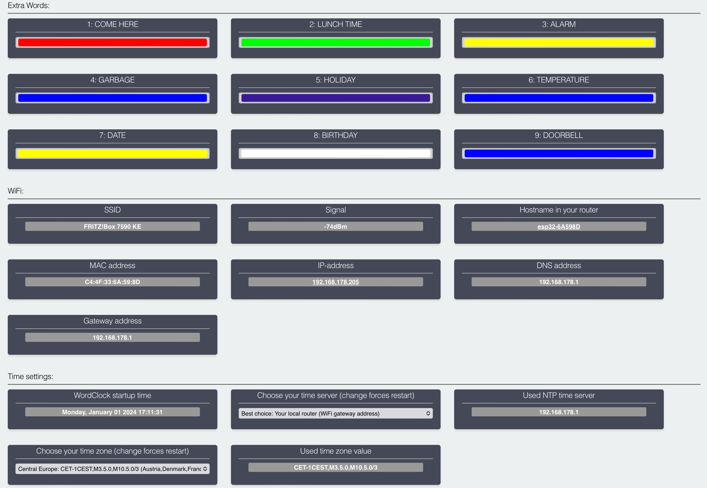
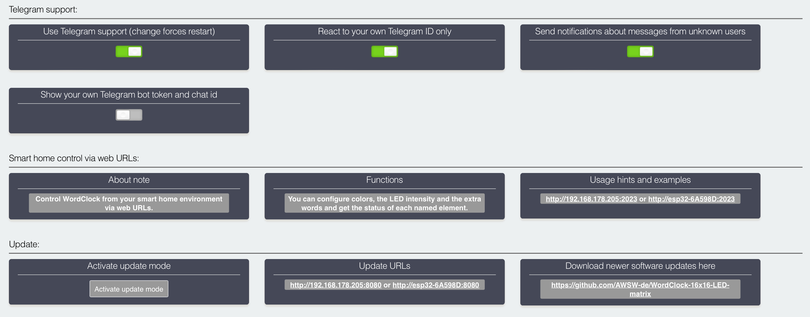
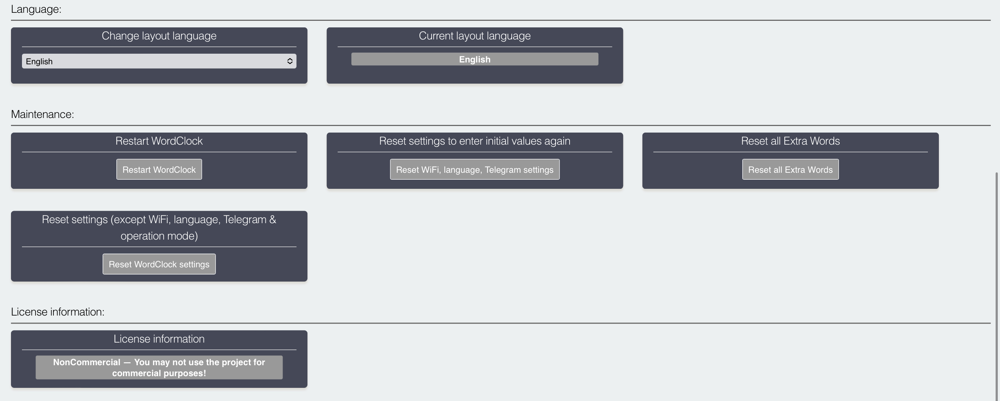
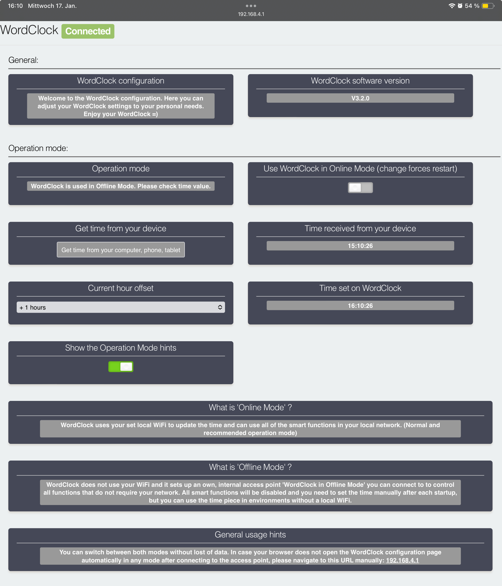
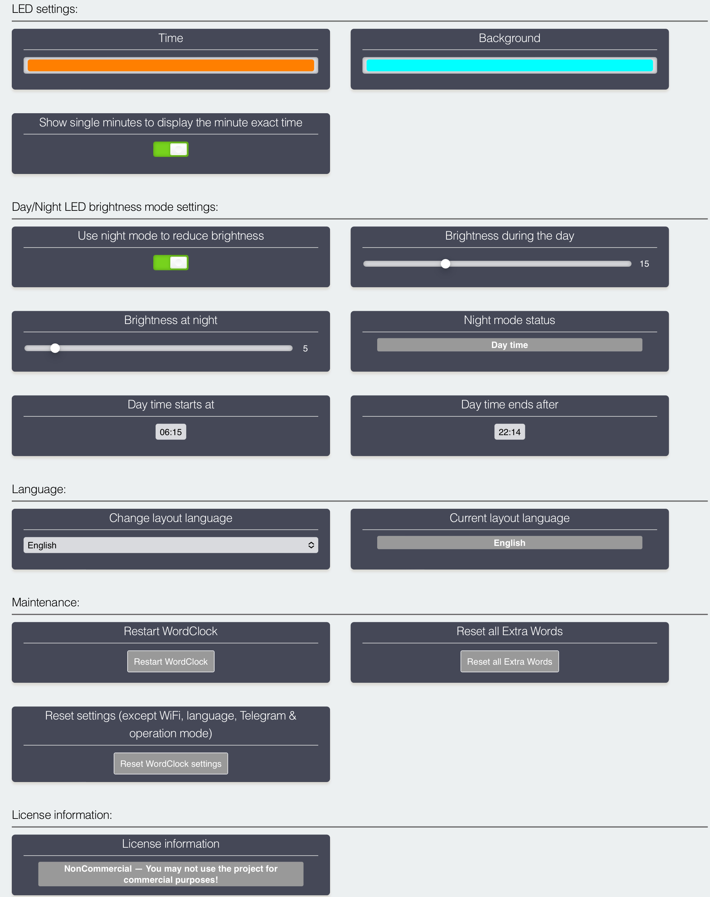

# WordClock-16x16-LED-matrix

WordClock 16x16 LED matrix, super easy build, 3 wires to solder only. Telegram, smart home and ext. events integration

Code for the <a href="https://www.printables.com/de/model/331012-wordclock-16x16-led-matrix">WordClock 16x16 LED matrix</a> 3D print on <a href="https://www.printables.com">www.printables.com</a>

WordClock can be used in "Online Mode" with all the smart functions controlled via your network environment and otional via Telegram and also in "Offline Mode" where you can use the time piece function only without the need of a local WiFi. In both operation modes you can configure the device via the shown internal web portal.

**Layouts for DE, EN, NL and FR available:**

Setup video instructions available for <a href="https://www.youtube.com/watch?v=BrVKY1sfZgI">Microsoft Windows 10/11</a> and <a href="https://www.youtube.com/watch?v=GptDFKhga0k">Apple macOS</a>.

The project was also shown on the "Conrad TechnikHelden" channel: Thanks guys for the nice video! =)

 This work is licensed under a <a rel="license" href="http://creativecommons.org/licenses/by-nc/3.0/">Creative Commons Attribution-NonCommercial 3.0 Unported License</a>.

**Pictures of the “Online Mode” of V3.2.0:** 

**Pictures of the “Offline Mode” of V3.2.0:**

**Picture of the internal web server commands and Telegram usage:**

